# Olist Data Engineering Pipeline Architecture

```mermaid
flowchart LR

%% =========================
%% Data Pipeline
%% =========================

A["📄 Raw CSV Files<br/>(9 Olist Datasets)"]

B[("🐘 PostgreSQL<br/>Operational Database")]

C["📦 Parquet Data Lake<br/>(Processed Files)"]

D["🦆 DuckDB Warehouse"]

E["🟩 dbt Transformations<br/>Staging → Intermediate → Marts"]

F["📊 Analytics Marts<br/>Executive • Sales • Customers<br/>Products • Delivery • Reviews • Geography"]

H["📈 Streamlit Dashboard"]

I["👤 Business Users"]

%% =========================
%% Airflow
%% =========================

G["🌬️ Apache Airflow<br/>Pipeline Orchestration"]

%% =========================
%% Main Flow
%% =========================

A -->|"Python ETL"| B

B -->|"Export"| C

C -->|"Load"| D

D -->|"dbt Run"| E

E -->|"Materialize Models<br/>inside DuckDB"| F

F -->|"SQL Queries"| H

H -->|"Interactive Analytics"| I

%% =========================
%% Airflow Orchestration
%% =========================

G -.->|"Schedule & Monitor"| B
G -.-> C
G -.-> D
G -.-> E

%% =========================
%% Colors
%% =========================

style A fill:#D6EAF8,stroke:#1F618D,stroke-width:3px,color:#000

style B fill:#FAD7A0,stroke:#AF601A,stroke-width:3px,color:#000

style C fill:#D5F5E3,stroke:#1E8449,stroke-width:3px,color:#000

style D fill:#FCF3CF,stroke:#B7950B,stroke-width:3px,color:#000

style E fill:#E8DAEF,stroke:#6C3483,stroke-width:3px,color:#000

style F fill:#D6EAF8,stroke:#2874A6,stroke-width:3px,color:#000

style G fill:#FADBD8,stroke:#C0392B,stroke-width:3px,color:#000

style H fill:#D4EFDF,stroke:#239B56,stroke-width:3px,color:#000

style I fill:#EBF5FB,stroke:#5D6D7E,stroke-width:3px,color:#000

linkStyle default stroke:#2C3E50,stroke-width:2.5px,color:#000
```

## Pipeline Flow

1. Raw Olist CSV datasets are ingested into PostgreSQL.
2. PostgreSQL tables are exported as Parquet files to create the data lake.
3. Parquet datasets are loaded into DuckDB.
4. dbt transforms raw warehouse tables into staging, intermediate and mart models.
5. Apache Airflow orchestrates the complete pipeline.
6. Streamlit queries analytics marts from DuckDB.
7. End users explore interactive dashboards for business insights.